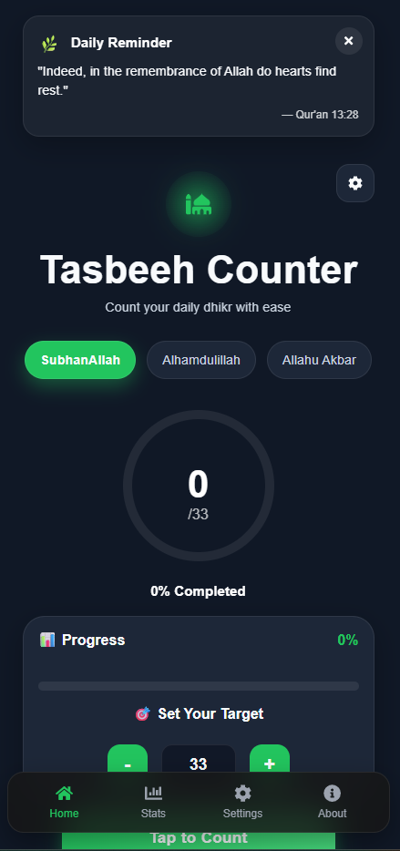
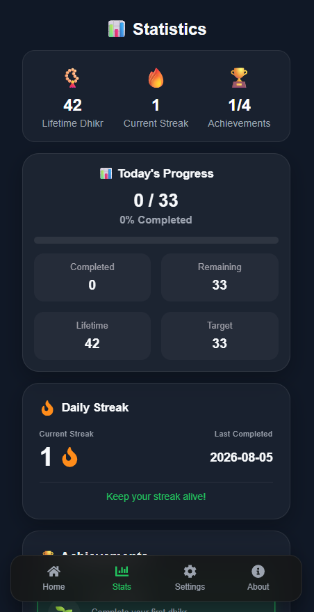
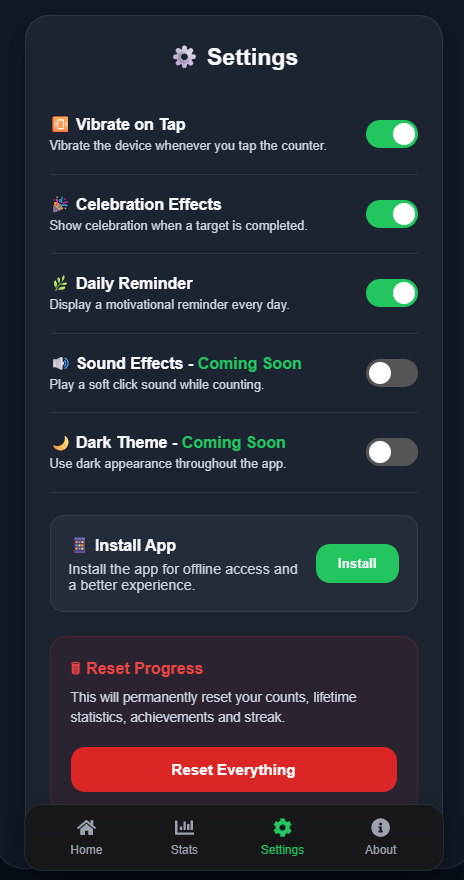
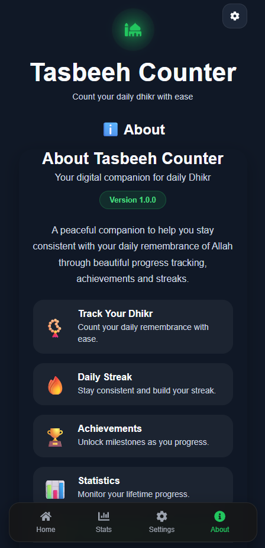
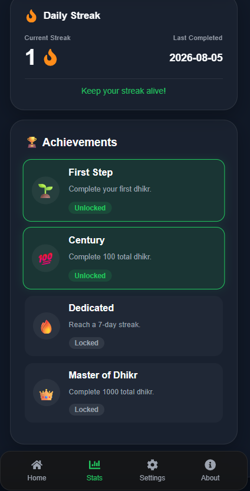
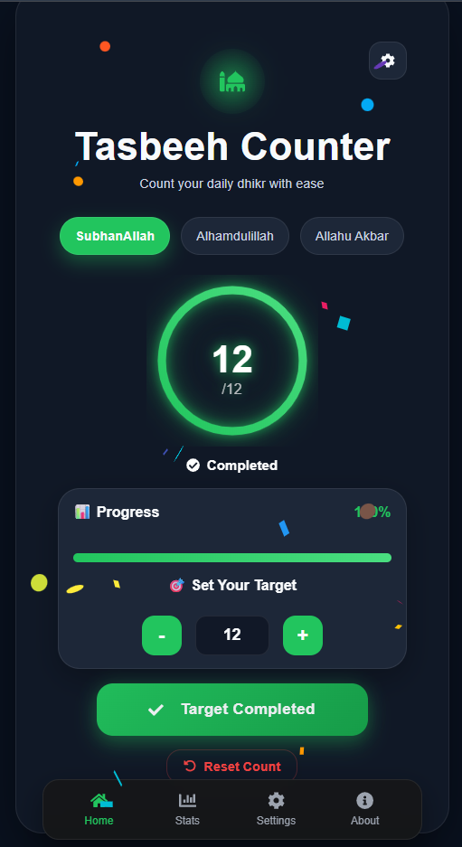

# 📿 Tasbeeh Counter

A modern and responsive **Progressive Web App (PWA)** built with **React** that helps Muslims keep track of their daily Dhikr through an elegant and distraction-free interface.

Designed with a clean UI, smooth animations, achievements, streak tracking, and offline support to encourage consistency in remembrance of Allah.

---

## ✨ Features

* 📿 Multiple Dhikr counters
* 🎯 Custom target for each Dhikr
* 📊 Live progress tracking
* 🔥 Daily streak tracking
* 🏆 Achievement system
* 🎉 Celebration effects when goals are completed
* 🔔 Daily reminder
* 📱 Installable as a Progressive Web App (PWA)
* 💾 Local Storage persistence
* 📈 Lifetime statistics
* ⚙️ User settings
* 📱 Fully responsive design
* ✨ Smooth animations with Framer Motion

---

## 🛠 Tech Stack

* React
* React Router
* CSS Modules
* Framer Motion
* React Icons
* Vite
* Vite PWA Plugin
* Local Storage API

---

## 🚀 Getting Started

Clone the repository

```bash
git clone https://github.com/wasifansari22/Tasbeeh-Counter.git
```

Go into the project folder

```bash
cd Tasbeeh-Counter
```

Install dependencies

```bash
npm install
```

Run the development server

```bash
npm run dev
```

Build for production

```bash
npm run build
```

Preview the production build

```bash
npm run preview
```

---

## 📱 Progressive Web App

This application supports Progressive Web App features including:

* Install on desktop and mobile
* Offline support (after deployment)
* Home screen installation
* App-like experience
* Automatic service worker updates

> Note: Some mobile browsers may require installing the app through the browser menu ("Install app") if the install prompt is not shown automatically.

---

## 🎯 Future Improvements (Version 2)

* 🌙 Functional Dark Mode
* 🔊 Sound Effects
* ☁️ Cloud Sync
* 👤 User Authentication
* 📅 Daily Notifications
* 📊 Advanced Analytics
* 🌍 Multiple Languages
* 📤 Export Statistics
* 🎨 Additional Themes

---

## 📸 Screenshots

### 🏠 Home Page



### 📊 Statistics Page



### ⚙️ Settings Page



### ℹ️ About Page



### 🏆 Achievements



### 🎊 Celebration



---

## 🤝 Contributing

Contributions, suggestions, and improvements are always welcome.

Feel free to fork the repository and submit a pull request.

---

## 📄 License

This project is licensed under the MIT License.

---

## 👨‍💻 Author

**Wasif Ansari**

GitHub: [@wasifansari22](https://github.com/wasifansari22)

If you enjoyed this project, consider giving it a ⭐ on GitHub.

May Allah accept our Dhikr and keep us consistent. Ameen. 🤲
